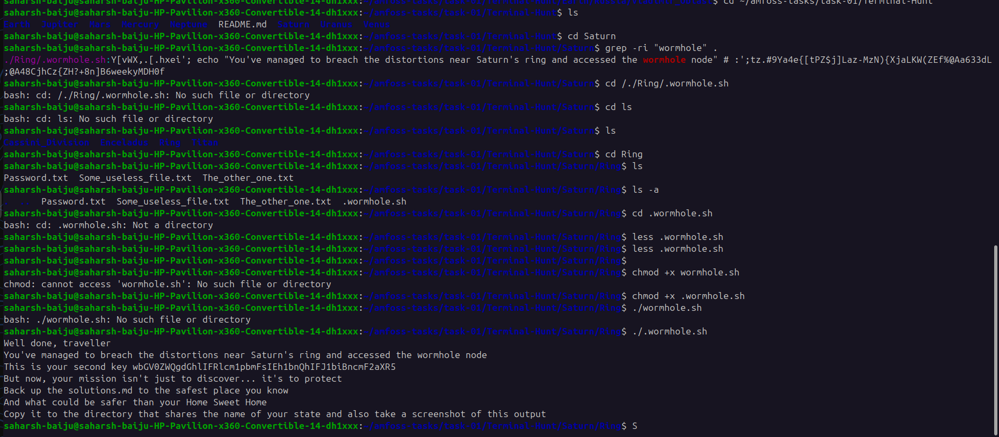
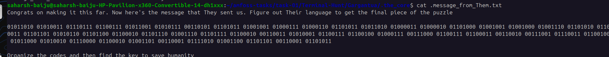
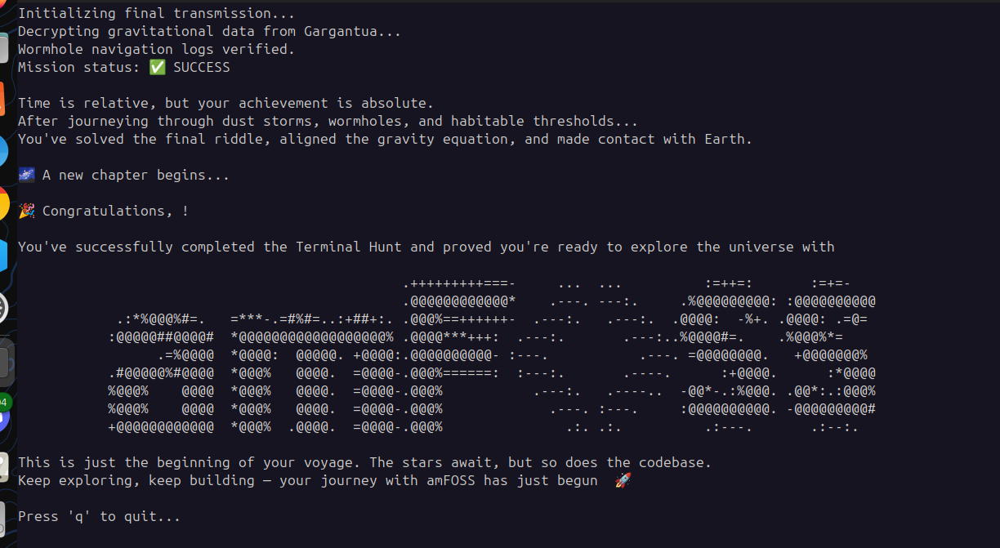

<h1>The first solution</h1>

Found the first key from russia folder using grep command and viewed it by "less"

You’ve uncovered the first piece of the puzzle — well done, explorer.

The string: T25lIGxhc3QgdGFzaywgYW5kIHlvdSdsbCBoYXZlIHN1Y2Nlc3NmdWxseSBjb21

Its meaning holds power... and danger.
Now that the facility has fulfilled its purpose, it's time to cover your tracks, erase it.  
Wipe it from existence so no one — and nothing — can trace your path.
The future depends on secrecy.

<h1>The second solution</h1>

#Well done, traveller
You've managed to breach the distortions near Saturn's ring and accessed the wormhole node
This is your second key wbGV0ZWQgdGhlIFRlcm1pbmFsIEh1bnQhIFJ1biBncmF2aXR5
But now, your mission isn't just to discover... it's to protect
Back up the solutions.md to the safest place you know
And what could be safer than your Home Sweet Home
Copy it to the directory that shares the name of your state and also take a screenshot of this output

Found the first key from russia folder using grep command and viewed it by "less"

You’ve uncovered the first piece of the puzzle — well done, explorer.

The string: T25lIGxhc3QgdGFzaywgYW5kIHlvdSdsbCBoYXZlIHN1Y2Nlc3NmdWxseSBjb21

Its meaning holds power... and danger.
Now that the facility has fulfilled its purpose, it's time to cover your tracks, erase it.  
Wipe it from existence so no one — and nothing — can trace your path.
The future depends on secrecy.

<h1>The third solution</h1>

<h1>The fourth solution</h>

<h2>The commands i used to solve</h2>
cd
grep
ls
chmod
-r
-a
-l
+x
