# TASK-11 : OVERTHEWIRE BANDIT

## MY EXPERIENCE

This task was really new to me except the basic linux commands which i learned from task-01 .By doing this task i learned new commands and ssh connectivity etc.
And even tough there was a learning curve the task was really engaging.
## Level 0

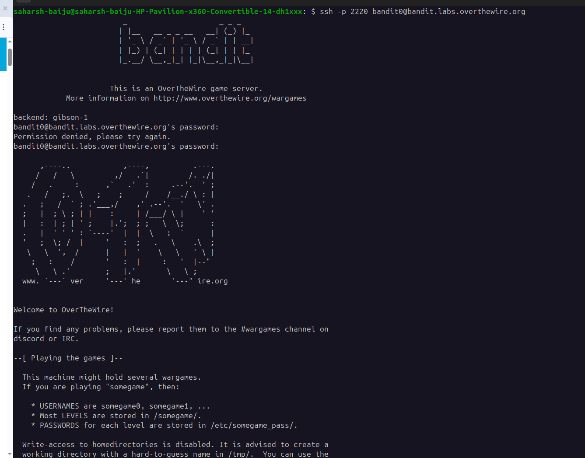

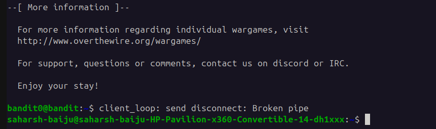

## Level 1

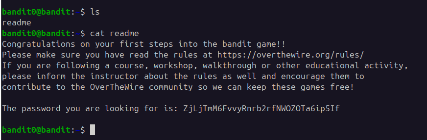

### Password

Password is - ZjLjTmM6FvvyRnrb2rfNWOZOTa6ip5If

### Commands used

ls and cat

## Level 2

### Password

MNk8KNH3Usiio41PRUEoDFPqfxLPlSmx

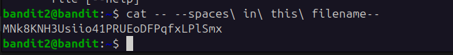

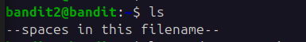

## Level 3

### Password

2WmrDFRmJIq3IPxneAaMGhap0pFhF3NJ

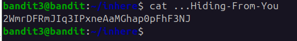

## Level 4

### Password

4oQYVPkxZOOEOO5pTW81FB8j8lxXGUQw

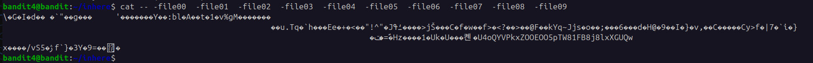

## Level 5

### Password

HWasnPhtq9AVKe0dmk45nxy20cvUa6EG

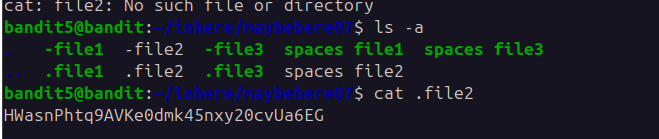

## Level 6

### Password

morbNTDkSW6jIlUc0ymOdMaLnOlFVAaj

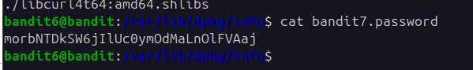

### Command Used

find / -user bandit7 -group bandit6 -size 33c 2>/dev/null

## Level 7

### Password

dfwvzFQi4mU0wfNbFOe9RoWskMLg7eEc

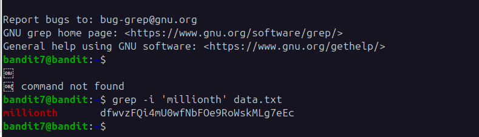

### Command Used

grep -i 'millionth' data.txt

## Level 8

### Password

4CKMh1JI91bUIZZPXDqGanal4xvAg0JM

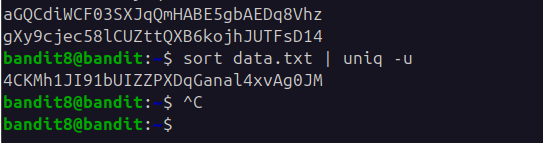

### Command Used

sort data.txt | uniq -u

## Level 9

### Password

FGUW5ilLVJrxX9kMYMmlN4MgbpfMiqey

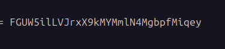

### Command Used

strings -a data.txt

## Level 10

### Password

The password is dtR173fZKb0RRsDFSGsg2RWnpNVj3qRr

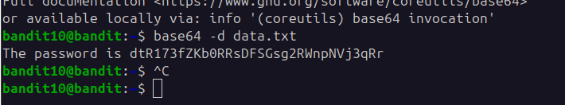

### Command Used

base64 -d data.txt

## Level 11

### Password

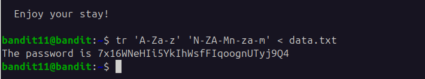

The password is 7x16WNeHIi5YkIhWsfFIqoognUTyj9Q4

### Command Used

tr 'A-Za-z' 'N-ZA-Mn-za-m' < data.txt

## Level 12

### Password

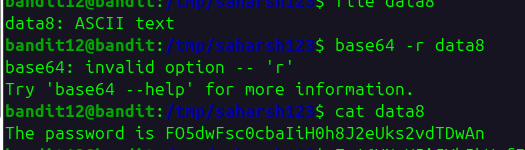

The password is FO5dwFsc0cbaIiH0h8J2eUks2vdTDwAn

### Command Used

* gzib1
* gzib2
* xxd xf
* mkdir
* mv
* cat
* ls

## Level 13

### Password

MU4VWeTyJk8ROof1qqmcBPaLh7lDCPvS

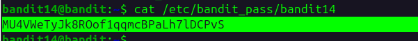

### Command Used

ssh -i sshkey.private bandit14\@localhost

## Level 14

### Password

8xCjnmgoKbGLhHFAZlGE5Tmu4M2tKJQo

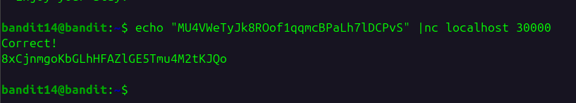

### Command Used

echo "MU4VWeTyJk8ROof1qqmcBPaLh7lDCPvS" | nc localhost 30000

## Level 15

### Password

kSkvUpMQ7lBYyCM4GBPvCvT1BfWRy0Dx

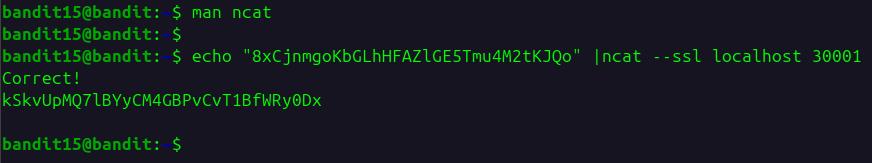

### Command Used

echo "8xCjnmgoKbGLhHFAZlGE5Tmu4M2tKJQo" | ncat --ssl localhost 30001
