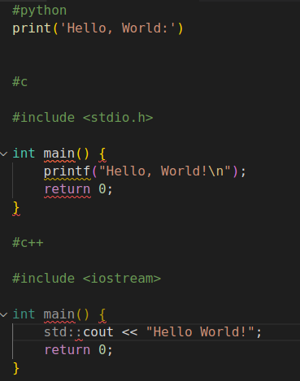
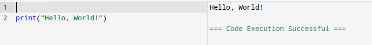
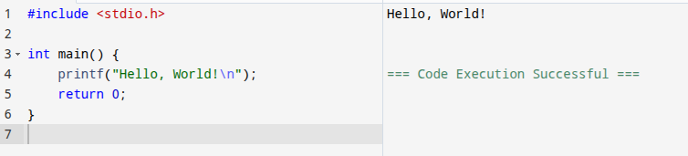
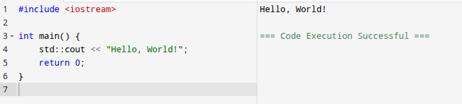

# TASK-12 : Hello,World!

## MY EXPERIENCE
I done the task at last,i only did the hello world with three languages.I first thought to skip this task but then decided to just attend it and do some of it.I compiled the c in an online compiler.

### codes

### outputs

